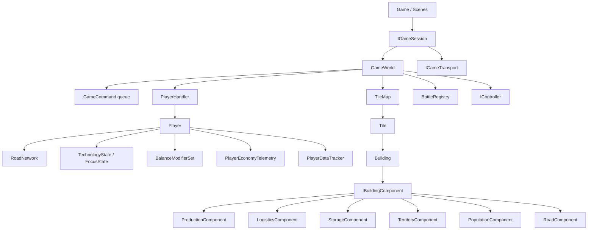

# Architektura silnika gry

- **Data audytu:** 2026-06-29
- **Zakres:** stabilny rdzen symulacji, mapa, budynki, produkcja, logistyka, sesje, serializacja, render snapshotow.
- **Cel:** opisac jak dziala silnik gry na poziomie implementacji, bez wchodzenia w rozgrzebane detale GUI i aktualnego reworku wojska.

## Model mentalny

Silnik jest zorganizowany wokol jednej zasady: **stan gry nalezy do `GameWorld`, a mutacje gameplayu powinny przechodzic przez `GameCommand` wykonywane na stalym ticku symulacji**.

Najwazniejsze warstwy:

- `GameWorld` - agregat symulacji: `TileMap`, gracze, kontrolery, bitwy, kolejka komend, wyniki komend, checksum.
- `IGameSession` - sposob uruchamiania swiata: single player, host multiplayer, klient multiplayer, petla w tle.
- `TileMap` - siatka kafli, zajetosc budynkami, terytorium, walidacja placementu, autoconnect logistyki.
- `Player` - stan gracza: budynki, zasoby strategiczne, technologie, focusy, modyfikatory, siec drog, telemetria ekonomii.
- `Building` + komponenty - obiekty postawione na mapie; konkretne zdolnosci wynikaja z komponentow.
- `RoadNetwork` + `Transportable` - fizyczny transport zasobow przez drogi i budynki.
- `Renderer` / snapshoty - warstwa prezentacji czyta stan lub render-safe `GameSnapshot`.

## Diagram warstw



## Sesje i autorytet symulacji

`IGameSession` oddziela petle symulacji od scen i transportu sieciowego.

Implementacje:

- `LocalSinglePlayerSession` dziedziczy po `HostGameSession`; single player uzywa tej samej autorytatywnej sciezki co host multiplayer.
- `HostGameSession` akumuluje czas przez `FixedSimulationClock`, wykonuje ticki i zbiera `GameCommandResult`.
- `LocalhostHostSession` dodaje transport, przyjmuje serializowane komendy klienta, wysyla ramki serwera, checksumy i snapshoty.
- `LocalhostClientSession` wysyla komendy, aplikuje zaakceptowane komendy hosta do lokalnego lustra i porownuje checksum.
- `ThreadedGameSession` opakowuje dowolna sesje i tyka ja w watku tla za `recursive_mutex`.

Fixed tick:

- `FixedSimulationClock::FixedDt = 1 / 100 s`.
- Maksymalnie 12 tickow na update, z obcieciem nadmiaru akumulatora.
- Host zwykle nadaje komendom `targetTick = currentTick + 1`.

## Rdzen `GameWorld`

`GameWorld` posiada:

- `TileMap tilemap`
- `PlayerHandler playerHandler`
- `BattleRegistry battles`
- `Renderer* render`
- `pendingCommands`
- `commandResults`
- `controllers`
- `simulationTick`

Glowna kolejnosc w `GameWorld::UpdateSimulation(dt)`:

1. zwiekszenie `simulationTick`,
2. update kontrolerow,
3. update focusow i badan graczy,
4. `ProcessCommands()`,
5. `tilemap.UpdateBuildings(dt)`,
6. `battles.Update(tilemap, dt)`,
7. update telemetrii ekonomii graczy.

To jest najwazniejszy kontrakt silnika. Kod UI, AI i siec powinny skladac intencje jako `GameCommand`, a nie bezposrednio zmieniac mape lub budynki.

## Komendy

`GameCommand` jest pozycyjnie serializowanym komunikatem intencji. Obecny `WireVersion` to `5`.

Typy komend:

- `BuildBuilding`
- `DestroyBuilding`
- `SetReceiver`
- `AttackBuilding`
- `IssueMilitaryOrder`
- `RecruitUnit`
- `StartFocus`
- `StartTechnologyResearch`
- `MoveDivision`

Przeplyw:

1. kontroler/UI/klient tworzy `GameCommand`,
2. sesja wywoluje `GameWorld::SubmitCommand`,
3. `SubmitCommand` nadaje `commandId` i `targetTick`,
4. `ProcessCommands` czeka do `targetTick`,
5. `ExecuteCommand` waliduje i mutuje stan,
6. `GameCommandResult` zapisuje akceptacje/odrzucenie oraz payload komendy.

## Mapa i terytorium

`TileMap` jest liniowa tablica `std::vector<Tile>` z konwersja:

- `id = x + y * sizeX`
- `coords = {id % sizeX, id / sizeX}`

`Tile` moze zawierac:

- wlasciciela terytorium (`Player* owner`),
- budynek-kotwice (`unique_ptr<Building> building`),
- referencje footprintu (`Building* buildingRef`),
- typ terenu i bogactwo zasobu.

Budynki wielokaflowe sa kotwiczone na jednym kaflu. Pozostale kafle footprintu dostaja `buildingRef`.

Placement wymaga:

- footprintu wewnatrz mapy,
- wlasnego terytorium,
- braku istniejacego budynku/refa,
- spelnienia wymagan terenu dla budynkow terenowych.

Terytorium jest projektowane przez komponent `TerritoryComponent`. `SetTerritory` maluje przyblizony okrag, a `RecalculateTerritory` zeruje terytorium danego gracza i odbudowuje je z aktywnych budynkow terytorialnych.

## Budynki i komponenty

Aktualny kod jest hybryda dziedziczenia i kompozycji:

- konkretne klasy (`Woodcutter`, `LumberMill`, `Headquarters`, `Village`, `GuardTower`, `Road`) nadal dziedzicza po `Building`,
- ale realne zdolnosci sa w komponentach rejestrowanych przez `RegisterComponent`,
- `Building` dziala jako fasada: kieruje zapytania o zasoby, produkcje, storage, terytorium i garnizon do odpowiedniego komponentu.

Najwazniejsze komponenty:

- `ProductionComponent` - cykl produkcji, input/output buffery, zuzycie bogactwa terenu.
- `LogisticsComponent` - supplierzy, receiverzy, alternatywni receiverzy, pending requesty.
- `WorkerComponent` - przypisani pracownicy i pojemnosc stanowisk.
- `RecipeComponent` - aktywna receptura i przelaczanie receptur.
- `ResearchComponent` - postep technologii w University.
- `StorageComponent` - magazyn wielu typow zasobow.
- `TerritoryComponent` - promien terytorium i HP.
- `GarrisonComponent` - oddzialy, rozkazy i sila bojowa.
- `SupplyBufferComponent` - bufor `FOOD_PROVISIONS` dla wojska.
- `RecruitmentComponent` - kolejka szkolenia.
- `PopulationComponent` - manpower i zapotrzebowanie na jedzenie.
- `RoadComponent` - pojemnosc i predkosc drogi.
- `SupplyPackageComponent` - pilot pakietow zaopatrzeniowych.

## Produkcja

Produkcja jest tickowana przez `Building::Update`, ktory:

1. obsluguje budowe (`constructionRemaining`),
2. uruchamia `Update` kazdego komponentu w kolejnosci rejestracji,
3. aktualizuje transportowane zasoby przebywajace na budynku.

`ProductionComponent`:

- automatycznie prosi gracza o workerow (`Player::AutoAssignWorkers`),
- utrzymuje requesty na brakujace inputy,
- startuje cykl, gdy sa inputy, workerzy i miejsce w output bufferze,
- po zakonczeniu cyklu generuje zasoby do output bufferow,
- przy produkcji terenowej zuzywa `Tile::resourceRichness`,
- wysyla outputy przez `LogisticsComponent::DispatchOutputs`.

Efektywny czas cyklu zalezy od:

- bazowego `cycleTime`,
- modyfikatorow `BalanceModifierSet`,
- stosunku workerow,
- produktywnosci zywnosciowej populacji.

## Logistyka i transport

Logistyka jest fizyczna: zasob jest obiektem `Resource`, ktory dziedziczy po `Transportable` i przemieszcza sie przez sciezke kafli.

Skladniki:

- `ResourcePool` - fixed-size pool zasobow, bez alokacji per resource.
- `ResourceBuffer` - przechowuje wskazniki do zasobow z poola.
- `LogisticsComponent` - decyduje, czego brakuje i skad brac.
- `RoadNetwork` - liczy sciezke BFS po wlasnym terytorium, drogach i docelowym budynku.
- `Transportable::Update` - przesuwa zasob o jeden etap sciezki po czasie `transportTime`.

Wazna cecha: siec drog jest per gracz (`Player::roadNetwork`) i mapuje tile id na `NavigationNode`.

## Gracz

`Player` jest agregatem mechanik gracza:

- `StrategicResourcePool` dla manpower/workers/soldiers,
- `RoadNetwork`,
- `TechnologyState` i `FocusState`,
- `StateDevelopment`,
- `BalanceModifierSet`,
- `PlayerDataTracker`,
- `PlayerEconomyTelemetry`,
- `ArmyGroupRegistry`.

`PlayerDataTracker` jest wazny dla wydajnosci i determinizmu: przechowuje indeksy budynkow per typ/per komponent, zeby czeste zapytania nie musialy skanowac calej mapy.

## Dane i balans

Budynki sa konfigurowane z `assets/data/buildings.rtsdata` przez `BuildingConfig`.

Mechanika modyfikatorow:

```text
wartosc = (base + additive) * multiplier
```

Modyfikatory moga byc filtrowane po:

- typie budynku,
- typie zasobu,
- typie jednostki,
- zasiegu globalnym, budynku, obszaru lub terytorium.

Technologie, focusy i rozwoj panstwa emituja modyfikatory do `Player::balanceModifiers`.

## Render i snapshoty

`GameWorld::DrawMap` renderuje trzy cache'owane warstwy:

- teren,
- budynki,
- terytorium.

Warstwy sa odswiezane przy zmianie kamery lub flagach dirty:

- `terrainDirty`
- `buildingsDirty`
- `territoryDirty`

`GameWorld::BuildSnapshot` tworzy uproszczony snapshot pod render/widok sieciowy:

- tick,
- lokalny player id,
- rozmiar mapy,
- terrain texture id,
- kolor wlasciciela,
- typ i footprint budynku.

Ten snapshot nie jest pelnym stanem gameplayu. Dokumentacja sieci powinna traktowac go jako widok mapy / bootstrap wizualny, nie jako kompletne recovery symulacji.

## Serializacja

Formaty serializacji sa reczne i pozycyjne:

- `GameCommand::Serialize/TryDeserialize`, `WireVersion = 5`
- `GameCommandResult`, `WireVersion = 3`
- `GameServerFrame`, `WireVersion = 1`
- `GameSnapshot`
- `GameWorld::SaveToFile/LoadFromFile`, `RTS_SAVE 13`
- pomocnicze payloady lobby w `Scenes.cpp`

Save load odbudowuje:

1. parametry swiata i kamere,
2. graczy, technologie, focusy,
3. kafle i wlascicieli,
4. budynki i komponenty,
5. pending connections po wczytaniu wszystkich budynkow,
6. terytorium, road network i autotile drog.

## Inwarianty, ktorych warto pilnowac

- Mutacje gameplayu ida przez `GameCommand`, szczegolnie w UI i sieci.
- W sciezce symulacji preferowane jest `std::map` dla deterministycznej kolejnosci iteracji.
- Budynki wielokaflowe musza miec tylko jedna kotwice i poprawnie ustawione `buildingRef`.
- Po ukonczeniu budowy trzeba zaktualizowac road network, autoconnect i terytorium.
- Przy zmianie save/wire trzeba inkrementowac odpowiedni version.
- `ResourceType::Null = 255` jest sentinelem, nie zwyklym zasobem.
